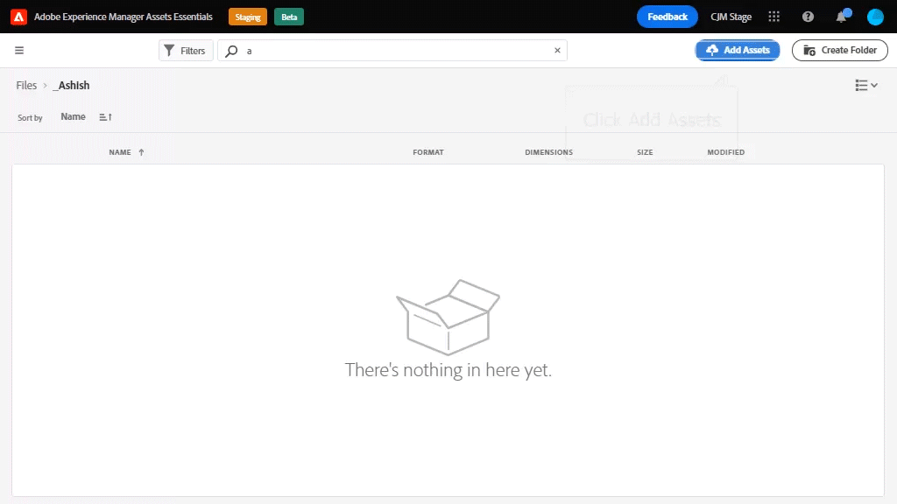
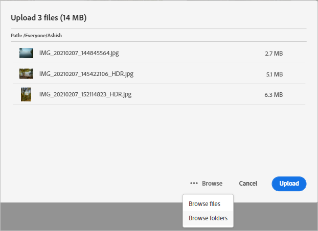
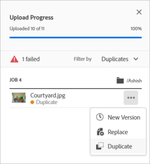
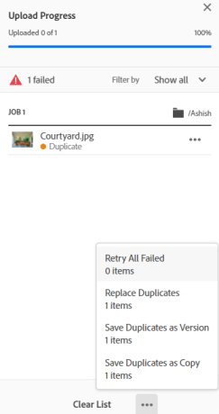

# Upload assets {#add-assets}

To add new assets to work with, upload a few assets from your local file system. Many of the [common file formats are supported](/help/get-started.md#supported-files).

You can use the following methods to upload one or more assets or a folder containing assets:

* Drag assets or folders on the user interface and follow the on-screen instructions.
* Click **[!UICONTROL Add Assets]** option from the toolbar and add some files to the upload dialog.

You can use any of these methods to upload assets after creating a folder. To create an empty folder, click **[!UICONTROL Create Folder]** from the toolbar. While [!DNL Assets Essentials] offers a powerful, full-text search functionality, you can also use folders to organize your assets better.

Once you have selected the files, you get a confirmation dialog to add more files or to remove already selected files. To add more files to a selection, click **[!UICONTROL Browse]** and the select **[!UICONTROL Browse files]** or **[!UICONTROL Browse folders]**. Add more files or folders from the same or from a different folder.

Once all files are queued, click **[!UICONTROL Upload]**.

*Figure: Before you upload the selected assets, you can add or remove assets from the queue.*

## View upload progress and status {#upload-progress}

When you upload many assets or nested folders to [!DNL Assets Essentials], some assets can fail to upload for various reasons such as duplicate asset and network issues.

To track the upload progress, click **[!UICONTROL Upload Progress]** option on the toolbar. A panel displays the upload progress of all assets.

To view a subset of assets based on the upload progress or status, use the filter in the **[!UICONTROL Upload Progress]** sidebar. The various filters are to display all assets, completed uploads, in-progress uploads, queued assets to be uploaded, paused uploads, duplicate assets, and assets that failed to upload.  

*Figure: Filter the assets that you attempted to upload based on their upload status or upload progress.*

## Manage failed uploads {#resolve-upload-fails}

By default, you cannot upload duplicate assets as the duplicate assets are marked as failed uploads. To resolve, you can create a version, delete and replace the existing assets, or create a duplicate copy by renaming the asset to be uploaded. You can resolve one asset at a time or do it for all failed duplicates in bulk.

*Figure: For duplicate assets that fail to upload by default, resolve the issue one asset at a time.*

*Figure: For duplicate assets that fail to upload by default, resolve issues for all assets at once.*

>[!TIP]
>
>You can upload assets to the DAM repository directly from within your [!DNL Creative Cloud] desktop applications. See how [[!DNL Assets Essentials] integrates with [!DNL Adobe Asset Link]](/help/integration.md). 
