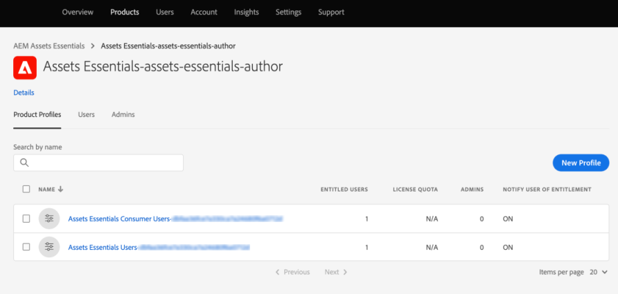
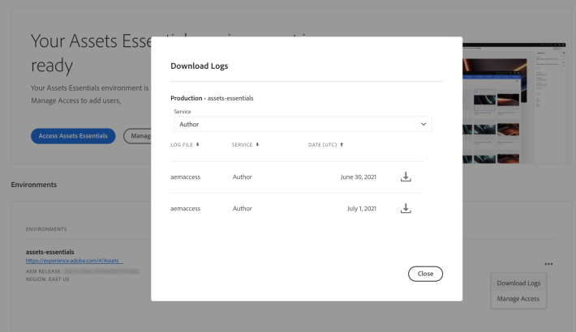

# Deploy [!DNL Assets Essentials] and add users {#administer}

[!DNL Adobe Experience Manager Assets Essentials] is provisioned by Adobe for its customers. As part of the provisioning, [!DNL Assets Essentials] is added to a customer's organization in [!DNL Adobe Admin Console]. The customers also have access to [!DNL Experience Manager Cloud Manager] as a deployment tool and to [!DNL Admin Console] to manage user entitlements to [!DNL Assets Essentials] solution.

Administrators perform the following tasks:

* [Deploy [!DNL Assets Essentials]](#deploy-essentials) for their organization.
* [Manage the user access](#add-users-to-essentials) of organization members to [!DNL Assets Essentials].
* Optionally, [view service status and logs](#view-logs).

## Deploy [!DNL Assets Essentials] {#deploy-essentials}

After provisioning, [!DNL Assets Essentials] entitlement is added to your organization in [!DNL Admin Console]. Before the solution is available to the user, an organization administrator must deploy it. The administrator does a one-time deployment using [!DNL Cloud Manager] user interface. After the initial deployment, Adobe does the service maintenance and updates. After the solution is provisioned, the administrator receives an email from Adobe. The email contains a welcome message and a link to get started. To deploy, follow these steps:

1. From the link in the email, access and login to [Admin Console](https://adminconsole.adobe.com). If you have administrator access to more than one organization account, then select the appropriate organization or switch to it using the switcher in the top bar. The product card for [!DNL Assets Essentials] is visible in the [!DNL Admin Console].

   ![[!DNL Assets Essentials] card in [!DNL Admin Console]](assets/essentials-in-admin-console.png)

   *Figure: [!DNL Assets Essentials] card in [!DNL Admin Console].*

1. Add yourself as an administrator to the `AEM Assets Essentials - Cloud Manager` product profile in the [!DNL Admin Console]. Instead of yourself, you can add another member of your organization or you can add more than one administrator.

1. Click  to [!UICONTROL Select product profiles], and then select [!UICONTROL Deployment Manager - Assets Essentials] as the **[!UICONTROL product profile]**. The user added in this step receives an email from Adobe with access to [!DNL Cloud Manager] and can do the deployment.

   ![Add an administrator and select a product profile in [!DNL Admin Console]](assets/adminconsole-user1.png)
   
   *Figure: Add an administrator and select a product profile in [!DNL Admin Console].*

1. To access [!DNL Cloud Manager], click the link in the email with access to [!DNL Cloud Manager]. Alternatively, access [https://experience.adobe.com/#/cloud-manager/](https://experience.adobe.com/#/cloud-manager/) in your browser.

1. In the Cloud Manager user interface, click **[!UICONTROL Add Program]** from the upper-right corner.

1. Provide a name of your choice and optionally upload an image (it represents the program in [!DNL Cloud Manager]), and then click **[!UICONTROL Create]**. [!DNL Cloud Manager] takes a few minutes to set up the program.

1. When the program is ready, hover pointer over the tile and click .

1. To add [!DNL Assets Essentials] service to your organization, click **[!UICONTROL Add Environment]**, select a name and deployment region, and click **[!UICONTROL Save]**. You cannot change the deployment region later. Try to match the deployment region of [!DNL Assets Essentials] with the deployment region of the other solution with which you intend to use [!DNL Assets Essentials]. The matching is to ensure fastest possible network access to digital assets and lowest possible latency.

   ![Add an environment in [!DNL Cloud Manager]](assets/cloudmanager-add-environment-for-essentials.png)

   *Figure: Add an environment in [!DNL Cloud Manager] to start using [!DNL Assets Essentials].*

1. After several minutes, when the environment is successfully created, you can access the [!DNL Admin Console] and add your organization's users to [!DNL Assets Essentials] solution. Click  and select the **[!UICONTROL Manage Access]** option.

   ![Ready environment in [!DNL Cloud Manager]](assets/cloudmanager-manage-access-essentials.png)

   *Figure: An environment in [!DNL Cloud Manager] that is ready to use.*

## User management {#add-users-to-essentials}

An administrator manages which users have access to [!DNL Assets Essentials]. Administrators use [!DNL Adobe Admin Console] to add or remove user access. [!DNL Assets Essentials] has the following two types of user access available.

* **[!DNL Assets Essentials] Users** have access to the complete user interface. These users can upload, organize, tag, and find digital assets.
* **[!DNL Assets Essentials] Consumer Users**: have access to the embedded asset selection experience in [!DNL Adobe Journey Optimizer] email template editor. For more information, see [Use [!DNL Assets Essentials] in [!DNL Journey Optimizer]](https://experienceleague.adobe.com/docs/journey-optimizer/using/create-messages/assets-essentials.html).

In [!DNL Admin Console], these two access types are represented by two [!UICONTROL Product Profiles]. To add and remove members of your organization to any of the two profiles, follow these steps:

1. Access [!DNL Admin Console] for your organization, click **[!UICONTROL Products]** in the top bar, click **[!UICONTROL AEM Assets Essentials]**, and then click [!DNL Assets Essentials] environment. [!DNL Assets Essentials] has two product profiles that represent access for regular and consumer users.

   

   *Figure: Two profiles are available to add the two types of users.*

1. To add a user to a group, click the group, select **[!UICONTROL Add User]**, provide the user details, and click **[!UICONTROL Save]**. When you add a user, the user receives an email invitation to get started. You can turn off the email invitations in the product profile settings in [!DNL Admin Console].

   ![Add a user to [!DNL Assets Essentials]](assets/adminconsole-add-user.png)

   *Figure: Add a user to [!DNL Assets Essentials] from [!DNL Admin Console].*

1. To remove a user from a group, click the group, select an existing user, and select **[!UICONTROL Remove User]**.

>[!TIP]
>
>In [!DNL Admin Console], you can manage the users in bulk using CSV files. To know more, see [[!DNL Admin Console] documentation](https://helpx.adobe.com/enterprise/using/accounts.html).

## View service status and access logs {#view-logs}

After provisioning, administrators deploy [!DNL Assets Essentials] only once. After the initial deployment, Adobe does the service maintenance and updates. Administrators can use the [!DNL Cloud Manager] user interface to check the service status and to download the recent access logs.

1. When users report issues, check the service status of [!DNL Assets Essentials] in the **[!UICONTROL Program Overview]** interface. During the normal working of the solution, the status is `Running`. If [!DNL Cloud Manager] displays any other status, create a support ticket in the [!DNL Admin Console] support section.

   ![The status of [!DNL Assets Essentials] in [!DNL Cloud Manager]](assets/cloudmanager-manage-access-essentials.png)

   *Figure: The normal status of [!DNL Assets Essentials] in [!DNL Cloud Manager] is `Running`.*

1. To download the recent access logs, click , select **[!UICONTROL Download Logs]**, and follow the on-screen instructions. You can audit the HTTPS access requests using the logs.

   

   *Figure: Option to download the access logs.*

>[!MORELIKETHIS]
>
>* [[!DNL Admin Console] help](https://helpx.adobe.com/enterprise/using/admin-console.html)
>* [[!DNL Cloud Manager] help](https://experienceleague.adobe.com/docs/experience-manager-cloud-manager/using/introduction-to-cloud-manager.html)
>* [Adobe Journey Optimizer documentation](https://experienceleague.adobe.com/docs/journey-optimizer/using/ajo-home.html)
>* [Release notes](release-notes.md)
>* [Get started using [!DNL Assets Essentials]](get-started.md)
