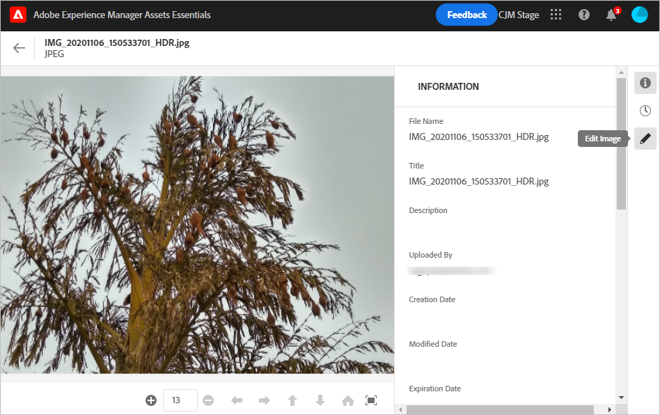

## Edit images in Assets Essentials {#edit-images}

Assets Essentials uses Adobe Photoshop Express to do the following actions: Spot healing, Crop and straighten, Resize image, Adjust image. Open an image to preview it. Click  from the rail on the right.

Assets Essentials provides smart editing options powered by Adobe Photoshop Express. You can save the edited image as a new version. You can revert to original asset later.

<!-- TBD:
How to view a list of versions and some info about creation date, etc. Is this same as timeline concept in Assets?
How to preview old version image?
How to pick a version and revert to it anywhere from the timeline. 
-->