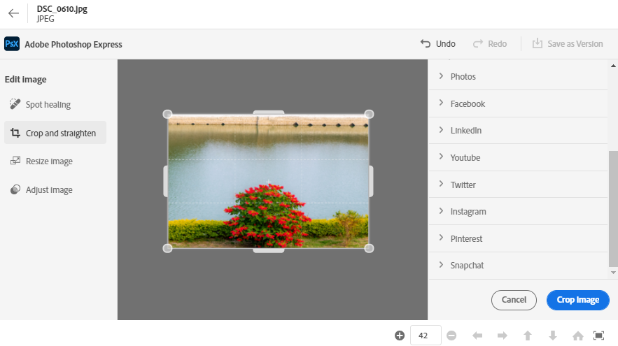

# Edit images in [!DNL Assets Essentials] {#edit-images}

[!DNL Assets Essentials] provides user-friendly editing options that are powered by [!DNL Adobe Photoshop Express]. The editing actions that are available are Spot healing, Crop and straighten, Resize image, and Adjust image.

After editing an image, you can save the new image as a new version. Versioning helps you to revert to the original asset later, if needed. To edit an image, open its preview and click **[!UICONTROL Edit Image]**  from the rail on the right.

*Figure: Use image editing options powered by [!DNL Adobe Photoshop Express].*

## Spot heal images {#spot-heal-images}

If there are minor spots or small objects on an image, you can edit and remove those using the spot healing feature provided by Adobe Photoshop.

The brush samples the retouched area and make the repaired pixels blend seamlessly into the rest of the image. Use a brush size that is only slightly larger than the spot you want to fix.

For more information about how Spot Healing works in Photoshop, see [retouching and repairing photos](https://helpx.adobe.com/photoshop/using/retouching-repairing-images.html).

## Crop and straighten images {#crop-straighten-images}

Using the crop and straighten option you can do basic cropping, rotate image, flip it horizontally or vertically, and crop it to dimensions suitable for popular social media websites.

To save your edits, click **[!UICONTROL Crop Image]**. After editing, you can save the new image as a version.

Many default options let you to crop your image to the best proportions that that fit various social media profiles and posts.

<!--
TBD: Insert animated GIF of all the available social media options. 
-->

>[!MORELIKETHIS]
>
>* [View version history of an asset](/help/understand-interface.md#view-versions)
