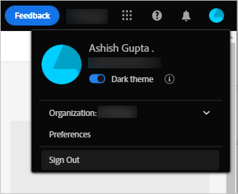
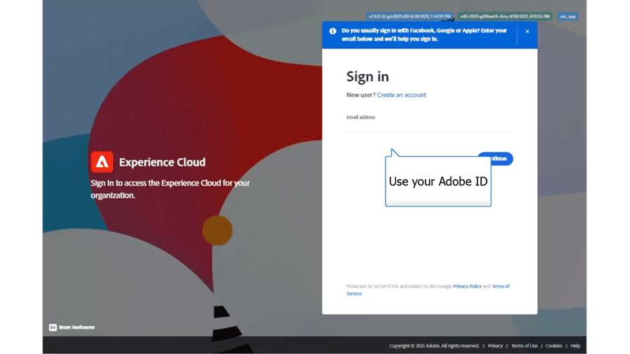
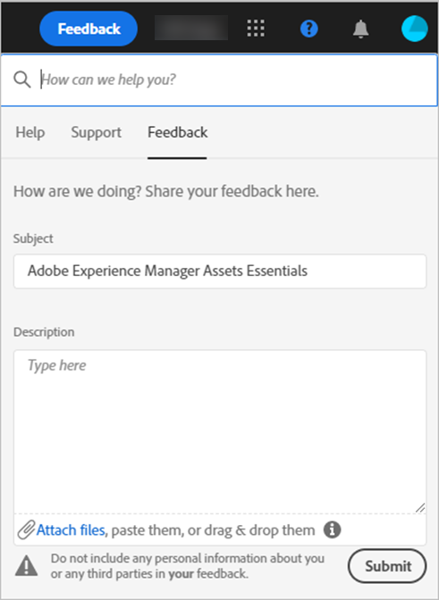

# Get started using [!DNL Experience Manager Assets Essentials] {#assets-essentials-get-started}

<!-- TBD: Rename the file and title and anchor. -->

<!-- TBD: Quick start steps as 1. Upload assets, 2. search and download 3. Edit, share, and organize -->

To access [!DNL Assets Essentials], use the access received via the beta program and log in at [https://experience.adobe.com/#/assets](https://experience.adobe.com/#/assets). To receive access, contact your organization's administrator.

<!-- TBD: Remove this line. -->

To get started using [!DNL Assets Essentials], see [understand the user interface](/help/get-started.md). Also, see a list of use cases, supported file types, and known issues below.

## Receive access to the [!DNL Assets Essentials] {#get-access}

Adobe provisions the solution and adds the designated person from your organization as an administrator. The administrators can provide access to various users from the organization by using [!DNL Admin Console]. For requests related to your access, contact your organization administrator.

## Configure [!DNL Assets Essentials] {#configuration}

<!-- TBD: Move this to get started -->

If the users are a part of different organizations, they can switch between the organization. To open preferences, click on the avatar in the upper-right corner of the user interface.

Users can switch between the light and dark themes in the solution preferences.

<!-- TBD: What can admins configure? What more can users configure? Any doc that describes Exp Cloud preferences? 
Metadata forms is out of the scope of 6/17 GA. When the functionality is added, link to it from here. It is about configuring metadata UI. -->

## Login experience {#login-experience}

When logging in, after providing the credentials, you can be prompted to select an account. In this case, select `Company or School Account` to proceed.

## Understand the [!DNL Assets Essentials] user interface {#understand-interface-navigation}

[!DNL Assets Essentials] offers an intuitive and user-friendly user interface. The clean interface makes assets and related information easy to find and remember.

When you log into [!DNL Assets Essentials], you see the following interface.

<!-- TBD: Update this screenshot. Remove top bar. Remove 2 labels from top bar. -->

![[!DNL Assets Essentials] user interface](assets/essentials-interface1.png)

*Figure: First login screen and where to find the salient features.*
&nbsp;&nbsp;&nbsp; *A: Left sidebar to browse repository and provides access to a few other options.*
&nbsp;&nbsp;&nbsp; *B: Display or collapse the left sidebar to increase asset-viewing area.*
&nbsp;&nbsp;&nbsp; *C: Filter search results.*
&nbsp;&nbsp;&nbsp; *D: Search box.*
&nbsp;&nbsp;&nbsp; *E: Options to sort assets.*
&nbsp;&nbsp;&nbsp; *F: Provide product feedback.*
&nbsp;&nbsp;&nbsp; *G: Edit your user preferences or sign out.*
&nbsp;&nbsp;&nbsp; *H: Switch between different views.*

<!-- TBD: Need an embedded video here with narration. It has to be hosted on MPC to be embeddable. -->

## [!DNL Assets Essentials] use cases {#use-cases}

The various digital asset management (DAM) tasks that you can accomplish using [!DNL Assets Essentials] are below.

| User tasks | Functionality and how-to information |
|-----|------|
| How do I discover assets? | <ul> <li>[Browse repository](/help/navigate-view.md#view-assets-and-details) </li> <li> [Preview asset](/help/navigate-view.md#view-assets-and-details) and [download assets](/help/manage-organize.md) </li> <li>[View detailed metadata](/help/metadata.md) </li> <li>[Search assets](/help/search.md)</li></ul> | 
| How do I add new assets? | <ul> <li>[Upload new assets and folders](/help/add-delete.md#add-assets)</li> <li>[Monitor upload progress and manage uploads](/help/add-delete.md)</li> <li>[Resolve duplicates](/help/add-delete.md#resolve-upload-fails)</li> </ul> |
| How do I update assets or related information? | <ul> <li>Change an existing asset</li> <li>[Create versions](/help/manage-organize.md#create-versions) and [view versions](/help/navigate-view.md#view-versions)</li> <li>[Edit images](/help/edit-images.md)</li> </ul> |
| How do I delete assets? | <ul> <li>[Delete assets](/help/manage-organize.md)</li> <li>Recover deleted assets</li> <li>Permanently delete assets</li> </ul> |
| How do I search for assets in the repository? | <ul> <li>[Search within a specific folder](/help/search.md)</li> <li>[Saved searches](/help/search.md)</li> <li>[Search for recently viewed assets](/help/search.md)</li> <li>[Full-text search](/help/search.md) |
| How do I edit assets in the repository? | <ul> <li>[In-browser edits using Adobe Photoshop Express](/help/edit-images.md)</li> <li>[Crop for a social media profile](/help/edit-images.md#crop-straighten-images)</li> <li>[View and manage versions](/help/manage-organize.md#create-versions)</li> <li>Use [Adobe Asset Link](/help/integration.md#integrations)</ul></ul> |
| How do I share assets or find shared assets? | <ul> <li>Shared by me</li> <li>Shared with me</li> <li>Share for comments and review</li> <li>Unshare assets</li> </ul> |
| How do I collaborate with others and get my assets reviewed | <ul> <li>Share for review</li> <li>Provide comments. Resolve and filter comments</li> <li>Annotations on images</li> <li>Assign tasks to specific users and prioritize</li> </ul> |
| Can [!DNL Assets Essentials] integrate with other solutions? | <ul> <li>[Use Asset Selector in [!DNL Adobe Journey Optimizer]](/help/integration.md) (beta)</li> <li>[[!DNL Adobe Asset Link] for [!DNL Creative Cloud]](/help/integration.md)</li> <li>Integration with [!DNL Creative Cloud Team] Libraries (beta)</li> </ul> |

## Supported file formats {#supported-files}

The above use cases are supported for the following file types.

*  Images: GIF, JPG, PNG, and TIFF
*  Documents: DOCX, PDF, PPTX, and XLSX
*  Videos: MP4

There are some minor known issues in how each feature works with each supported format. These issues are documented in the specific feature articles.

##  Provide product feedback {#provide-feedback}

The team welcomes feedback related to product, beta program, documentation, and more. Use any of the following methods to provide feedback for the [!DNL Assets Essentials] beta.

* Slack channel for beta program.
* Feedback option in the user interface lets you provide feedback without switching your working application. It also allows attaching files such as screenshots or video recording of an issue.
  

## Known issues {#known-issues}

For now, the product is in beta and has the following known issues. As the product evolves, Adobe keeps addressing the issues. For now, if you come across any other issues, [provide feedback](#provide-feedback) to the team.

* For now, you can only select one asset or folder at a time.
* For now, you can download only individual assets and not folders.
