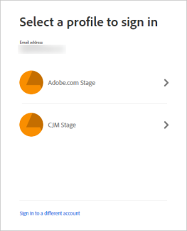

# Get started using [!DNL Experience Manager Assets Essentials] {#assets-essentials-get-started}

To get started using the solution, use your access to the beta program and log in at [https://experience.adobe.com/#/assets](https://experience.adobe.com/#/assets).

When logging in, you might be prompted to select an account after you provide the credentials. In this case, select "Company or School Account" to proceed.

To get started using the solution interface, see [understand the user interface](/help/understand-interface.md). To know more about the solution, see a list of supported use cases and file types below.

## Supported use cases {#use-cases}

The various digital asset management (DAM) tasks that you can accomplish using Assets Essentials are below.

| User tasks | Functionality and how-to information |
|-----|------|
| How do I discover assets? | <ul> <li>[Browse repo](/help/understand-interface.md#view-assets-and-details) </li> <li> Preview and download assets </li> <li>View detailed metadata </li> <li>[Search assets](/help/search-assets.md)</li></ul> | 
| How do I add new assets? | <ul> <li>Upload new assets</li> <li>Upload folder structures</li> <li>Monitor progress and manage uploads</li> <li>Resolve duplicates</li> </ul> |
| How do I update assets or related information? | <ul> <li>Change existing asset</li> <li>Create and see versions</li> <li>[Edit images](/help/edit-images.md)</li> </ul> |
| How do I delete assets? | <ul> <li>Delete assets</li> <li>Recover deleted assets</li> <li>Permanently delete assets</li> </ul> |
| How do I search for assets in the repository? | <ul> <li>[Search within a specific folder](/help/search-assets.md)</li> <li>[Saved searches](/help/search-assets.md)</li> <li>Search for recently viewed asset</li> <li>Full-text search</li> <li>Search metadata</li> </ul> |
| How do I edit assets in the repository? | <ul> <li>Smart edits using Adobe Photoshop Express</li> <li>Crop for a social media profile</li> <li>Maintain versions. Can revert</li> </ul> |
| How do I share my assets? | <ul> <li>Shared by me</li> <li>Shared with me</li> <li>Share for comments and review</li> <li>Unshare assets</li> </ul> |
| How do I collaborate with others and get my assets reviewed | <ul> <li>Share for review</li> <li>Provide comments. Resolve and filter comments</li> <li>Annotations on images</li> <li>Assign tasks to specific users and prioritize</li> </ul> |
| Can Assets Essentials integrate with other solutions? | <ul> <li>[Use Asset Selector in Adobe Journey Optimizer](/help/integration.md) (beta)</li> <li>[Adobe Asset Link for Creative Cloud](/help/integration.md)</li> <li>Integration with Creative Cloud Team Libraries (beta)</li> </ul> |

## Supported file formats {#supported-files}

The above use cases are supported for the following file types.

*  Images: GIF, JPG, PNG, and TIFF
*  Documents: DOCX, PDF, PPTX, and XLSX
*  Videos: MP4

There may be minor limitations in the functionality for specific formats.

##  Provide product feedback {#provide-feedback}

The team welcomes feedback related to product, beta program, documentation, and more. Use any of the following methods to provide feedback for the Assets Essentials beta.

* Slack channel for beta program.
* Feedback option in the user interface.
  
