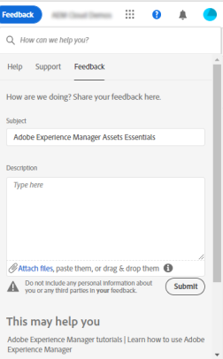

# [!DNL Experience Manager Assets Essentials] details {#assets-essentials-details}

The various digital asset management (DAM) tasks that you can do using Assets Essentials are below.

| Capabilities | User tasks |
|-----|------|
| Discover | <ul> <li>Browse repo </li> <li> Preview and download assets </li> <li>View detailed metadata </li> <li>Search assets</li></ul> | 
| Create | <ul> <li>Upload new assets</li> <li>Upload folder structures</li> <li>Monitor progress and manage uploads</li> <li>Resolve duplicates</li> </ul> |
| Update | <ul> <li>Change existing asset</li> <li>Create and see versions</li> <li>Edit images</li> </ul> |
| Delete | <ul> <li>Delete assets</li> <li>Recover deleted assets</li> <li>Permanently delete assets</li> </ul> |
| Search | <ul> <li>Search within a specific folder</li> <li>Saved searches</li> <li>Search for recently viewed asset</li> <li>Full-text search</li> <li>Search metadata</li> </ul> |
| Edit | <ul> <li>Smart edits using Adobe Photoshop Express</li> <li>tbd</li> <li>Crop for a social media profile</li> <li>Maintain versions. Can revert</li> </ul> |
| Share | <ul> <li>Shared by me</li> <li>Shared with me</li> <li>Share for comments and review</li> <li>Unshare assets</li> </ul> |
| Review and collaborate | <ul> <li>Share for review</li> <li>Provide comments. Resolve and filter comments</li> <li>Annotations on images</li> <li>Assign tasks to specific users and prioritize</li> </ul> |
| Integrations | <ul> <li>Use Asset Selector in Adobe Journey Optimizer (beta)</li> <li>Adobe Asset Link for Creative Cloud</li> <li>Integration with Creative Cloud Team Libraries (beta)</li> </ul> |

## Supported file formats {#supported-files}

The above use cases are supported for the following file types.

* Images: GIF, JPG, PNG, and TIFF
* Documents: DOCX, PDF, PPTX, and XLSX
* Videos: MP4

There may be minor limitations in the functionality for specific formats.

## Provide product feedback {#provide-feedback}

The team welcomes feedback related to product, beta program, documentation, and more. Use any of the following methods to provide feedback for the Assets Essentials beta.

* Slack channel for beta program.
* Feedback option in the user interface.
  
