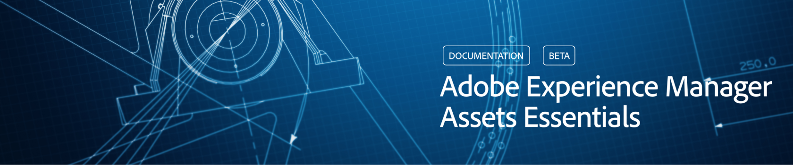

# [!DNL Adobe Experience Manager Assets Essentials] overview {#assets-essentials}

<!-- TBD: Update this banner to remove Beta label. 

-->

Adobe offers a robust Digital Asset Management (DAM) solution for you to get the most out of your digital assets. As a part of Adobe Experience Manager product line, Adobe is offering a new SaaS solution to store, manage, and discover digital assets, that also integrate natively with other Adobe solutions. 

[!DNL Experience Manager Assets Essentials] is a new, lightweight edition of [!DNL Adobe Experience Manager Assets]. [!DNL Assets Essentials] provide unified asset management and collaboration with a simplified and a consistent user interface. The ease-of-use enables more creative and marketing teams to store, discover, and distribute digital assets.

[!DNL Assets Essentials] was launched at Adobe Summit. Read more about the announcement in this [blog post introducing [!DNL Assets Essentials]](https://blog.adobe.com/en/publish/2021/04/27/introducing-adobe-experience-manager-assets-essentials-to-simplify-collaboration-across-teams.html).

The solution focuses on simple interface and efficient search and discovery of digital asset, to ensure asset utilization, governance, and brand consistency across teams. The end-user experience can be via a standalone web user interface and an embedded experience in other Adobe solutions. 

For administration, it requires simpler configuration and administration that is, has a high time to value. Administrators get immediate access to the solution and can work with familiar functionality and user entitlements in [!DNL Adobe Admin Console].

Managing your digital assets with Assets Essentials is as simple as the following 3 steps:

* **Step 1**: Upload and view assets.
* **Step 2**: Search and download the required assets.
* **Step 3**: Manage and organize the assets. 
