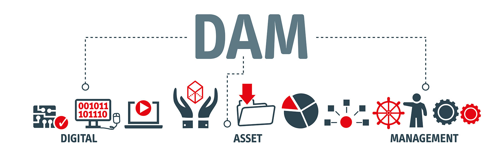

# [!DNL Adobe Experience Manager Assets Essentials] overview {#assets-essentials}

 

Adobe offers a robust Digital Asset Management (DAM) solution for you to get the most out of your digital assets. As a part of Adobe Experience Manager product line, Adobe is offering a new SaaS solution to store, manage, and discover digital assets, that also integrates natively with other Adobe solutions. 

Adobe Experience Manager Assets Essentials is a new, lightweight edition of Adobe Experience Manager Assets. Experience Manager Assets Essentials provide unified asset management and collaboration with a simplified and a consistent, easy-to-use user interface. This enables more creative and marketing teams to store, discover, and distribute digital assets.

The solution focuses on simple interface and efficient search and discovery of digital asset, to ensure asset utilization, governance, and brand consistency across teams. The end-user experience can be via a standalone web user interface and an embedded experience in other Adobe solutions. 

For administration, it requires simpler configuration and administration that is, has a high time to value. Administrators get immediate access to the solution and can work with familiar functionality and user entitlements in Adobe Admin Console.

 Assets Essentials is currently available for beta testing and is undergoing active development. Your feedback is welcome. Initially, some options of the user interface may be different from what is documented in this guide. As the beta program progresses, the solution and this document will have parity.
