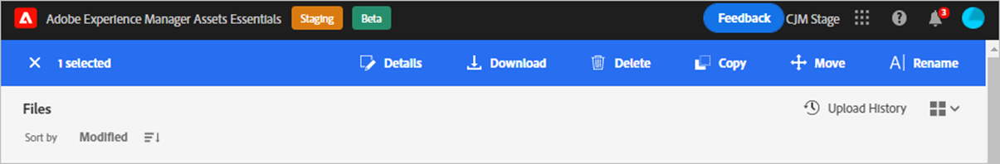

# Manage assets {#manage-assets}

Use [!DNL Assets Essentials] to accomplish the following asset management tasks. When you select an asset, the following options display in the toolbar at the top.

*  Deselect the selection.
*  Click to preview an asset and view the detailed metadata. When previewing, you also have an option to view the versions and edit an image.
*  Download the selected asset to your local file system. You do not see a download option for a folder.
*  Delete the selected asset or folder.
*  Copy the selected file or folder.
*  Move the selected asset or folder to a different location in the repository hierarchy.
*  Rename the selected asset or folder. Use a unique name else rename fails with a warning.
