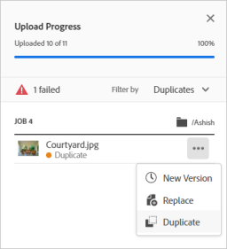

# Manage assets {#manage-assets}

You can do various digital asset management (DAM) tasks easily using the user-friendly interface of [!DNL Assets Essentials]. After you've added the assets, you can search, download, move, copy, rename, delete, update, and edit your assets. 

Use [!DNL Assets Essentials] to accomplish the following asset management tasks. When you select an asset, the following options display in the toolbar at the top.

*Figure: Options available in the toolbar for a selected image.*

*  Deselect the selection.
*  Click to preview an asset and view the detailed metadata. When previewing, you can view the versions and edit an image.
*  Download the selected asset to your local file system.
*  Delete the selected asset or folder.
* <!--  --> Checkout an asset.
*  Copy the selected file or folder.
*  Move the selected asset or folder to a different location in the repository hierarchy.
*  Rename the selected asset or folder. Use a unique name otherwise renaming fails with a warning. You can try again with a new name.
* <!--  --> Assign tasks to other users to collaborate on an asset.

You can view the same options on assets thumbnails.

[!DNL Assets Essentials] displays only the relevant options in the toolbar that depend on the type of the selected asset.

*Figure: Options available in the toolbar for a selected folder.*

*Figure: Options available in the toolbar for a selected PDF file.*

## Download and distribute assets {#download}

You can select one or more assets or folders or a combination of both, and download the selection to your local file system. You can edit the assets and upload again or distribute the assets outside [!DNL Assets Essentials]. You can also [download the renditions](/help/add-delete.md#renditions) of an asset.

## Asset versioning {#versions-of-assets}

<!-- 
TBD: query for engineering: How many versions are maintained. What happens when we reach that limit? Are old versions automatically removed? -->

[!DNL Assets Essentials] versions the assets when the assets are uploaded again that is updated or are edited. You can view version history, past versions, and can restore a past version of assets as the latest version, that is reverted to a previous version if needed. Asset versions are created in the following scenarios:

* Upload a new asset with the same filename as an existing asset and in the same folder as the existing asset. [!DNL Assets Essentials] prompts to either overwrite the previous asset or save the new asset as a version. See [upload duplicate assets](/help/add-delete.md#resolve-upload-fails).

  

  *Figure: When uploading an asset named the same as an existing asset, you can create a version of the asset.*

* Edit an image and click **[!UICONTROL Save as Version]**. See [edit images](/help/edit-images.md).

  

  *Figure: Save edited image as a version.*

* Open the versions of an existing asset. Click **[!UICONTROL New Version]** and upload a newer version of the asset in the repository.

  

### View versions of an asset {#view-versions}

When uploading a duplicate copy or a modified copy of an asset, you can create its versions. Versioning lets you review historical assets and revert to a previous version if needed.

To view versions, open an asset's preview and click **[!UICONTROL Versions]**  from the right sidebar. To preview a specific version, select it. To revert to it, click **[!UICONTROL Make Latest]**.

You can also create versions from the versions timeline. Select the latest version, click **[!UICONTROL New Version]**, and upload a new copy of the asset from your local file system.

*Figure: View versions of an asset, revert to a previous version, or upload another new version.*
