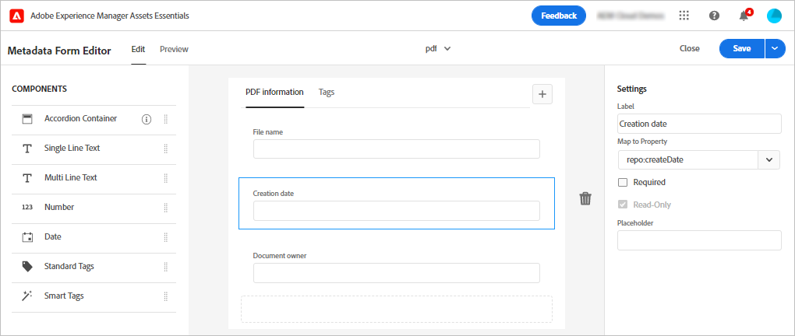

# Metadata in [!DNL Assets Essentials] {#metadata}

Metadata means data or description about the data. For example, your images as an asset can contain information about the camera it was clicked with or any copyright information. This information is metadata of the image. Metadata is critical for efficient asset management. Metadata is the collection of all the data available for an asset but it may not necessarily be contained in that asset.

Metadata helps you further categorize assets and is helpful as the amount of digital information grows. It is possible to manage a few hundred files based on just the filenames, thumbnails, and memory. However, this approach is not scalable. It falls short when the number of people involved and the number of managed assets increase.

With the addition of metadata, the value of a digital asset grows, because the asset becomes,

* More accessible - systems and users can find it easily.
* Easier to manage - you can find assets with the same set of properties easier and apply changes to them.
* Complete - asset carries more information and context with more metadata.

For these reasons, Assets provides you with the right means of creating, managing, and exchanging metadata for your digital assets.

## View the metadata {#view-metadata}

To view the metadata of an asset, browse to the asset or search the asset, select the asset, and click **[!UICONTROL Details]** in the toolbar.

*Figure: To view an asset and its metadata, click **[!UICONTROL Details]** from toolbar or double-click on the asset.*

The basic metadata such as title, description, and upload date is available in the [!UICONTROL Basic] tab. The [!UICONTROL Advanced] tab contains more advanced metadata such as camera model, lens details, and geotags. The [!UICONTROL Tags] tab contains auto-applied tags based on the contents of the image.

## Update metadata {#update-metadata}

You can update a few metadata fields manually. The fields includes [!UICONTROL Title], [!UICONTROL Description], [!UICONTROL Author], and [!UICONTROL Keywords].

## Tags {#tags}

[!DNL Assets Essentials] uses artificial intelligence provided by [Adobe Sensei](https://www.adobe.com/sensei.html) to automatically apply relevant tags to all your uploaded assets. These tags, aptly named Smart Tags, increase the content velocity of your projects by helping you find relevant assets quickly. The smart tags are an example of metadata that is not contained in the image. 

The smart tags are applied in near real time and are generated based on the contents of the image. When you upload an asset, the user interface displays [!UICONTROL Processing] on the asset thumbnail for some time. Once the processing is complete, you can [view the metadata](#view-metadata) and the smart tags.

*Figure: To view the Smart Tags of an asset, click **[!UICONTROL Details]** from toolbar or double-click on the asset.*

Smart tags also contain a confidence score as a percentage. It indicates the confidence associated with the applied tag. You can moderate the automatically applied smart tags.

## Add or update tags {#manually-tag}

You may add more tags to your assets, in addition to the Smart Tags that are added automatically using the [!DNL Adobe Sensei] smart service. Open an asset for preview, click [!UICONTROL Tags], and type the desired keywords in the [!UICONTROL Keywords] field. To add the tag, press Return. [!DNL Assets Essentials] indexes the keyword in near real time and your team can soon search the updated assets using the new keywords.

You can also remove tags from the [!UICONTROL Smart Tags] section that are automatically added by [!DNL Assets Essentials] to all the uploaded assets.

## Metadata forms {#metadata-forms}

Assets Essentials provides many standard metadata fields by default. Organizations have additional metadata needs and need more metadata fields to add business-specific metadata. Metadata forms let businesses add custom metadata fields to an asset's [!UICONTROL Details] page. The business-specific metadata improves the governance and discovery of its assets.

You can configure metadata forms for different types of assets (different MIME types). Use the same form name as the file's MIME type. Essentials automatically matches uploaded assets to the name of the form. For example, if a metadata form by the name `PDF` or `pdf` exists, then the uploaded PDF documents contains metadata fields as defined in the form. You can create forms from scratch or re-purpose an existing form.

>[!IMPORTANT] 
>
>The new metadata form for a specific file type completely replaces the default metadata form that [!DNL Assets Essentials] provides. If you delete or rename a metadata form, the default metadata fields are again available for new assets.

To create a metadata form, follow these steps:

1. In the left rail, click **[!UICONTROL Settings]** > **[!UICONTROL Metadata Forms]**.

   

1. Click **[!UICONTROL Create]**, in the upper-right area of the user interface.
1. Provide a name for the form and click **[!UICONTROL Create]**.
1. Provide a name for the tab in **[!UICONTROL Settings]** in the right rail.
1. From the **[!UICONTROL Components]** available in the left rail, drag the required components on a tab in the form. Drag the components in the desired sequence.

   

   *Figure: Metadata form creation interface with options to add components and option to preview the form.*

1. For each component, in the provide a name in the **[!UICONTROL Settings]** in the right rail, provide a mapping with the supported properties.
1. Optionally, for a component, select **[!UICONTROL Required]** to make the metadata field mandatory and select **[!UICONTROL Read-Only]** to make the field uneditable in the asset [!UICONTROL Details] page.
1. Optionally, click **[!UICONTROL Preview]** to preview the form that you are creating.
1. Optionally, add more tabs and the required components in each tab.
1. Click **[!UICONTROL Save]** when the form is complete.

Once a form is created, it is automatically applied when users upload an asset of the matching MIME type.

To reuse an existing form to create a new form, select a metadata form, click **[!UICONTROL Copy]** from the toolbar, provide a name, and click **[!UICONTROL Confirm]**. You can edit a metadata form to change it. When you change a form, it is used for assets uploaded after the change. It does not change the existing assets.

<!-- TBD: Cannot create a form using the second option. Documenting only the first option for now.
To reuse an existing form to create a new form, do one of these:

* Select a metadata form and click **[!UICONTROL Copy]** from the toolbar, provide a name, and click **[!UICONTROL Confirm]**.

* Click **[!UICONTROL Create]**, select **[!UICONTROL Use existing form structure as template]** option, and select an existing form. 
-->

<!-- TBD: Queries for PM and engg.

Can we edit the existing metadata in any form?

How to moderate smart tags?

Allow or deny list for smart tags?

What about Tags displayed just above Smart Tags in the UI?

Is there a detailed metadata tab. Where do the other details of an asset go?

How can one search based strictly on the metadata. Similar to AEM Assets GQL queries.
-->

<!-- TBD: Link to related articles if any.

>[!MORELIKETHIS]
>
>* [Search assets](search.md).
-->
