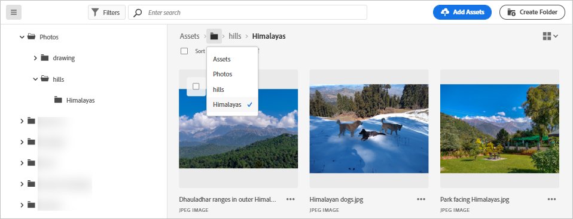
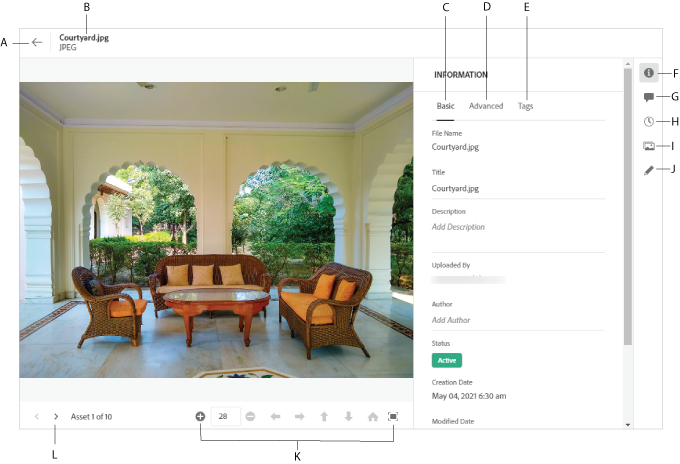

# Navigate to files and folders and view assets {#view-assets-and-details}

<!-- TBD: Give screenshots of all views with many assets. Zoom out to showcase how the thumbnails/tiles flow on the UI in different views. -->

<!-- TBD: The options in left sidebar may change. Shared with me and Shared by me are missing for now. Update this section as UI is updated. -->

## Understand the [!DNL Assets Essentials] user interface {#understand-interface-navigation}

[!DNL Assets Essentials] offers an intuitive and user-friendly user interface. The clean interface makes assets and related information easy to find and remember.

When you log into [!DNL Assets Essentials], you see the following interface.

<!-- TBD: Update this screenshot. Remove top bar. Remove 2 labels from top bar. -->

![[!DNL Assets Essentials] user interface](assets/essentials-interface1.png)

*Figure: First login screen and where to find the salient features.*
&nbsp;&nbsp;&nbsp; *A: Left sidebar to browse repository and provides access to a few other options.*
&nbsp;&nbsp;&nbsp; *B: Display or collapse the left sidebar to increase asset-viewing area.*
&nbsp;&nbsp;&nbsp; *C: Filter search results.*
&nbsp;&nbsp;&nbsp; *D: Search box.*
&nbsp;&nbsp;&nbsp; *E: Options to sort assets.*
&nbsp;&nbsp;&nbsp; *F: Provide product feedback.*
&nbsp;&nbsp;&nbsp; *G: Edit your user preferences or sign out.*
&nbsp;&nbsp;&nbsp; *H: Switch between different views.*

<!-- TBD: Need an embedded video here with narration. It has to be hosted on MPC to be embeddable. -->

## Browse and view assets and folders {#browse-repository}

You can browse to the required files or folders from the main user interface or from the left sidebar. When browsing, you can use the interface to view asset thumbnails to visually browse the repository or view asset details to quickly find the asset you want. The options available in the left sidebar are:

* **Assets**: List of all folders and assets in a tree view, that you have access to.
* **Recently Viewed**: List of assets that you previewed recently. [!DNL Assets Essentials] displays only the assets that you preview. It does not display here the assets that you scroll past when browsing the repository files or folders.
* **Libraries**: Access to [!DNL Adobe Creative Cloud Team] (CCT) Libraries view. This view is visible only if the user is entitled to CCT Libraries.

<!-- TBD: My Work Space shows task inbox and it is not visible on AEM Cloud Demos as of now. It is the source of truth server hence not documenting My Work Space option for now.
-->

You can open or collapse the left sidebar to increase the available asset-viewing area.

In [!DNL Assets Essentials], you can view assets, folders, and search results in four different types of layouts.

*  [!UICONTROL List View]
*  [!UICONTROL Grid View]
*  [!UICONTROL Gallery View]
*  [!UICONTROL Waterfall View]

To locate an asset, you can sort the assets in ascending or descending order of `Name`, `Relevancy`, `Size`, `Modified`, and `Created`.

To navigate into a folder, double-click on the folder's thumbnails or select the folder from the left sidebar. To view details of a folder, select it and click Details from the toolbar at the top. To navigate up and down the hierarchy, either use the left sidebar or use the breadcrumbs at the top.

*Figure: To browse the hierarchy, use the breadcrumbs at the top or the left sidebar.*

## Preview assets {#preview-assets}

Before you use, share, or download an asset, you can view it more closely. The preview feature lets you view not just the images but a few other supported asset types.

To preview an asset, select it and click [!UICONTROL Details]  from the toolbar at the top. You can not only view the asset but also view its detailed metadata and take other actions.

*A: Return to the current folder or current search result in the repository.*
*B: Name and format for the file you are previewing.*
*C: Basic metadata.*
*D: Advanced metadata.*
*E: Keywords and smart tags.*
*F: Preview asset and see metadata information.*
*G: Comment and annotate.*
*H: View and manage versions.*
*I: View renditions of the image.*
*J: Edit image.*
*K: Preview more closely. Zoom, full screen, and other options.*
*L: Proceed to previous or next asset in the current folder without going back to the folder.*

<!-- TBD: Describe the options.

Explicitly previewed assets are displayed as recently viewed assets. Give screenshot of this.
Other use cases after previewing.

-->

>[!MORELIKETHIS]
>
>* [View versions of an asset](/help/manage-organize.md#view-versions).
