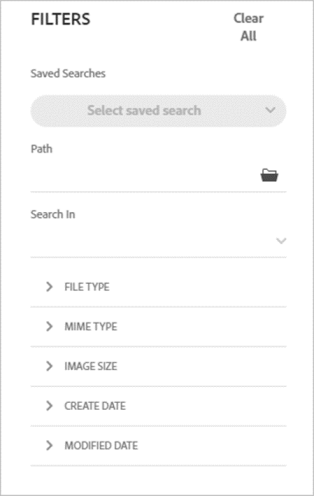

# Search assets in [!DNL Assets Essentials] {#search-assets}

Assets Essentials provides effective search, that just works by default. The search is comprehensive as it is full-text search. The powerful search functionality lets you quickly discover the appropriate asset and help you improve your content velocity. Assets Essentials provides full-text search and even searches through the metadata such as smart tags, description, copyright, and so on.

To search assets, 

* Click in the search box at the top of the page. By default, it searches within the folder that you are currently browsing. Do one of the following:

  

  * Search using a keyword and optionally change folder. Press Return.

  * Start working with a recently viewed asset, by searching for it directly. Click in the search box and select a recently viewed asset from the suggestions. 

## Filter search results {#refine-search-results}

You can filter the search results based on the following parameters.

*Figure: Filter searched assets based on various parameters.*

* File type: Filter the search results by the supported types of files that is, `Images`, `Documents`, and `Videos`.
* MIME type: Filter for one or more of the [supported file formats](/help/get-started.md#supported-files).
* Image size: Provide one of more of the minimum and maximum dimensions to filter images. Size is provided in dimensions in pixel and is not the file size of the images.
* Create date: The creation date of the asset as provided in the metadata. The standard date format used is `yyyy-mm-dd`.
* Modified date: The last modified date of the assets. The standard date format used is `yyyy-mm-dd`.

You can sort the searched assets in increasing or decreasing order of `Name`, `Relevancy`, `Size`, `Modified`, and `Created`.

<!--
## Saved searches {#saved-search}

-->
