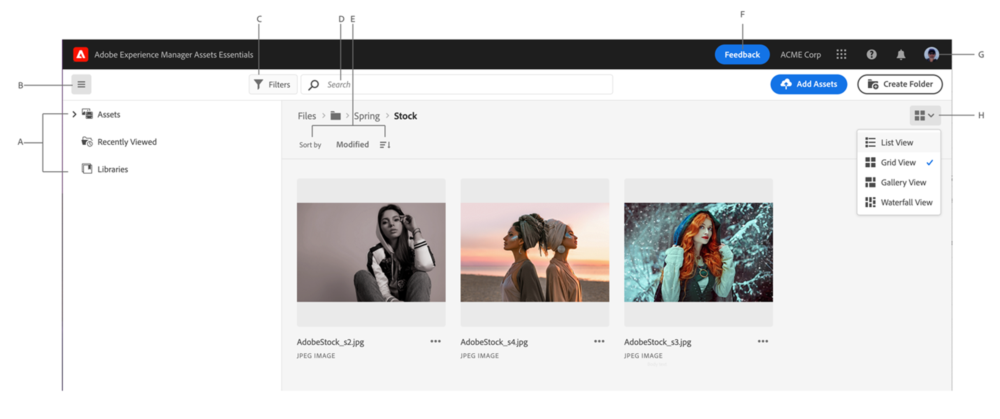
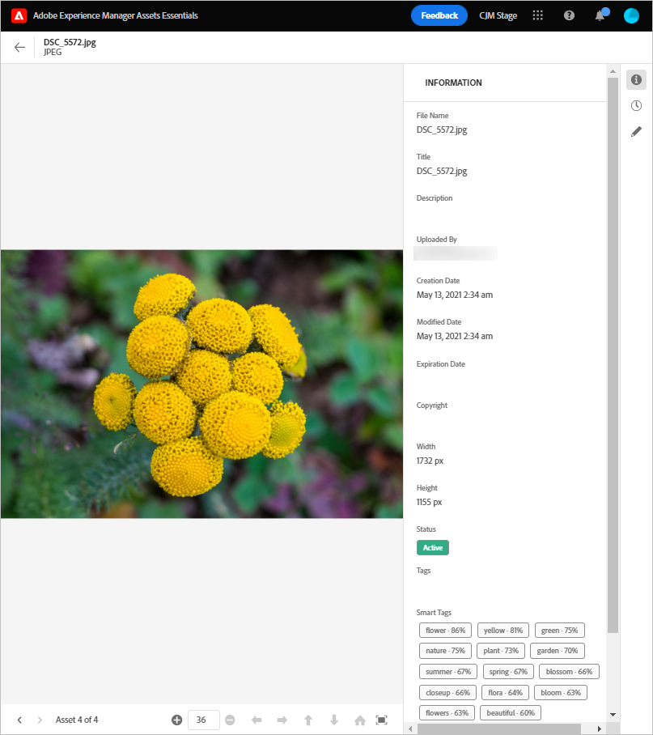

## Understand the [!DNL Assets Essentials] user interface {#understand-interface-navigation}

Assets Essentials offers very intuitive and user-friendly user interface. The clean interface makes assets and related information easy to find and remember.

When you log into Assets Essentials, you see the following interface.

*Figure: First login screen and where to find the salient features.*

* A: Left sidebar to browse repository and provides access to a few other options.
* B: Display or collapse the left sidebar to increase asset-viewing area.
* C: Filter search results.
* D: Search box.
* E: Options to sort assets.
* F: Provide product feedback.
* G: Edit your user preferences or sign out.
* H: Switch between different views.

## Detailed navigation {#detailed-navigation}

The options available in the left sidebar are:

* **Assets**: List of all folders and assets in a tree view, that you have access to.
* **Recently Viewed**: List of assets that you previewed recently. These are not the assets that displayed while browsing but the ones that were previewed.
* **Libraries**: Access to Adobe Creative Cloud Team (CCT) Libraries view. This view is visible only if the user is entitled to CCT Libraries.

You can open or collapse the left sidebar to increase the available asset-viewing area.

Some quick tips to help you navigate the solution and find a few prominent user interfaces are below:

* To find asset metadata, use left sidebar to navigate to the asset or search the required asset. Select the asset and click **[!UICONTROL Details]**.

## Views assets and their information {#view-assets-and-details}

To browse to an asset, use the navigation hierarchy in the left sidebar. When browsing, you can use the interface to view asset thumbnails to visually browse the repository or view asset details to quickly find the asset you want. Select an appropriate view from the list: List View, Grid View, Gallery View, or Waterfall View.

To preview an asset,

* Browse to an asset or search an asset.
* Click once to select the asset.
* Click Details in the toolbar at the top.
* Preview the asset and view its metadata.

To view the detailed metadata of an asset, browse to an image (or search it), select it, and click Details from the toolbar at the top. Alternatively, double-click the image.

To navigate into a folder, double-click on the folder's thumbnails or select the folder from the left sidebar. To view details of a folder, select it and click Details from the toolbar at the top. To navigate up and down the hierarchy, either use the left sidebar or use the breadcrumbs at the top.

