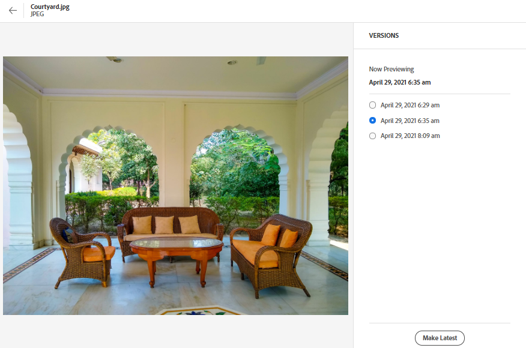

# Understand the [!DNL Assets Essentials] user interface {#understand-interface-navigation}

[!DNL Assets Essentials] offers an intuitive and user-friendly user interface. The clean interface makes assets and related information easy to find and remember.

When you log into [!DNL Assets Essentials], you see the following interface.

![[!DNL Assets Essentials] user interface](assets/essentials-interface1.png)

*Figure: First login screen and where to find the salient features.*
&nbsp;&nbsp;&nbsp; *A: Left sidebar to browse repository and provides access to a few other options.*
&nbsp;&nbsp;&nbsp; *B: Display or collapse the left sidebar to increase asset-viewing area.*
&nbsp;&nbsp;&nbsp; *C: Filter search results.*
&nbsp;&nbsp;&nbsp; *D: Search box.*
&nbsp;&nbsp;&nbsp; *E: Options to sort assets.*
&nbsp;&nbsp;&nbsp; *F: Provide product feedback.*
&nbsp;&nbsp;&nbsp; *G: Edit your user preferences or sign out.*
&nbsp;&nbsp;&nbsp; *H: Switch between different views.*

<!-- TBD: Need an embedded video here with narration. It has to be hosted on MPC to be embeddable. -->

## Detailed navigation {#detailed-navigation}

### Navigate to files and folders {#access-files-folders}

<!-- TBD: The options in left sidebar may change. Shared with me and Shared by me are missing for now. Update this section as UI is updated. -->

You can browse to the required files or folders from the main user interface or from the left sidebar. The options available in the left sidebar are:

* **Assets**: List of all folders and assets in a tree view, that you have access to.
* **Recently Viewed**: List of assets that you previewed recently. These assets are not displayed while browsing but the ones that were previewed.
* **Libraries**: Access to [!DNL Adobe Creative Cloud Team] (CCT) Libraries view. This view is visible only if the user is entitled to CCT Libraries.

You can open or collapse the left sidebar to increase the available asset-viewing area.

## View assets {#view-assets-and-details}

<!-- TBD: Give screenshots of all views with many assets. Zoom out to showcase how the thumbnails/tiles flow on the UI in different views. -->

In [!DNL Assets Essentials], you can view assets, folders, and search results in four different types of layouts.

*  [!UICONTROL List View]
*  [!UICONTROL Grid View]
*  [!UICONTROL Gallery View]
*  [!UICONTROL Waterfall View]

To browse to an asset, use the navigation hierarchy in the left sidebar. When browsing, you can use the interface to view asset thumbnails to visually browse the repository or view asset details to quickly find the asset you want.

To locate an asset, you can sort the assets in ascending or descending order of `Name`, `Relevancy`, `Size`, `Modified`, and `Created`.

To preview an asset, browse to the asset or search the asset, select the asset, and click **[!UICONTROL Details]** in the toolbar.

To navigate into a folder, double-click on the folder's thumbnails or select the folder from the left sidebar. To view details of a folder, select it and click Details from the toolbar at the top. To navigate up and down the hierarchy, either use the left sidebar or use the breadcrumbs at the top.

*Figure: To browse the hierarchy, use the breadcrumbs at the top or the left sidebar.*

### View versions of an asset {#view-versions}

When uploading a duplicate copy or a modified copy of an asset, you can create its versions. Versioning lets you review historical assets and revert to a previous version if needed.

To view versions, open an asset's preview and click **[!UICONTROL Versions]**  from the right sidebar. To preview a specific version, select it. To revert to it, click **[!UICONTROL Make Latest]**.

You can also create versions from the versions timeline. Select the latest version, click **[!UICONTROL New Version]**, and upload a new copy of the asset from your local file system.

*Figure: View versions of an asset, revert to a previous version, or upload another new version.*
